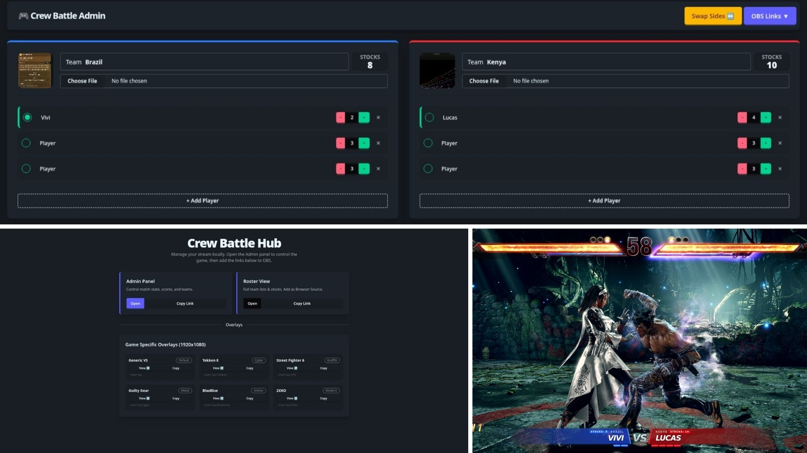

# Crew Battle Admin (JesterKit)

A local-first, web-based scoreboard manager designed for fighting game streamers. Control the match state in one tab and update your OBS overlays instantly without complex cloud hosting.



## ✨ Features

* **Admin Dashboard:** Easily manage team names, player lives, and active status.
* **Drag & Drop Logos:** Upload team logos directly from your computer (saved locally).
* **Instant OBS Sync:** Updates on the Admin panel reflect on OBS overlays in ~1 second via local polling.
* **Persistent Data:** Scores and names are saved to a local `data.json` file, so you never lose progress if the app restarts.
* **Game-Specific Overlays:** Custom designs for Tekken 8, SF6, Guilty Gear, and more.

---

## 🚀 Quick Run (For Streamers)

**No installation required.** This is the easiest way to use the app.

1.  **Download the Release:**
    Get the latest executable for your OS from the [Releases page](#).
2.  **Run the App:**
    * **Windows:** Double-click `CrewBattle-windows.exe`. A black window will appear.
    * **Mac:** Double-click the file. You may need to right-click > Open to bypass security.
    * **Linux:** See the section below.
3.  **Open the Dashboard:**
    Go to `http://localhost:3000` in your web browser.
4.  **Connect OBS:**
    Copy the links from the dashboard and paste them into OBS Browser Sources.

### 🐧 Linux Users (Important!)
If you double-click the file and nothing happens, the app is likely running **silently in the background**. You need to see the terminal window to close it later.

**How to run it properly:**
* **Option 1 (Terminal):** Open your terminal, drag the file into it, and hit Enter.
* **Option 2 (Launcher):** Create a Desktop Shortcut/Launcher and ensure **"Run in Terminal"** is checked in the properties.

---

## 💻 For Code People (Developers)

If you want to modify the source code or build it yourself.

### Prerequisites
* [Node.js](https://nodejs.org/) (v18+)
* [pnpm](https://pnpm.io/) (Recommended) or npm
* [Bun](https://bun.sh/) (Required only if building the executable)

### Installation & Setup

1.  **Install Dependencies:**
    ```bash
    pnpm install
    ```

2.  **Start Development Server:**
    This runs the app with hot-reloading (usually on port `5173`).
    ```bash
    pnpm dev
    ```

3.  **Build the Executable:**
    To create the standalone file using `@jesterkit/exe-sveltekit`:
    ```bash
    pnpm build
    ```
    *The output file will be in the `dist/` folder.*

---

## 🎥 OBS Setup Guide

1.  Open **OBS Studio**.
2.  Add a new **Browser Source**.
3.  Set **Width** to `1920` and **Height** to `1080`.
4.  Paste one of the URLs below into the **URL** field.
5.  *Tip: If the overlay doesn't update, right-click the source > Properties > "Refresh cache of current page".*

### 🎨 Available Overlays

If running from the executable, use port `3000`. If running from source (`pnpm dev`), use port `5173`.

| Overlay Type | URL (Executable) | URL (Dev Mode) | Description |
| :--- | :--- | :--- | :--- |
| **Roster View** | `http://localhost:3000/roster` | `http://localhost:5173/roster` | Full team lists & stocks |
| **Generic VS** | `http://localhost:3000/overlay` | `http://localhost:5173/overlay` | Standard Lower Third |
| **Tekken 8** | `http://localhost:3000/overlay/tekken` | `http://localhost:5173/overlay/tekken` | Cybernetic / Bottom Bar |
| **Street Fighter 6** | `http://localhost:3000/overlay/sf6` | `http://localhost:5173/overlay/sf6` | Graffiti / Lowkey |
| **Guilty Gear** | `http://localhost:3000/overlay/ggst` | `http://localhost:5173/overlay/ggst` | Heavy Metal / Center |
| **2XKO** | `http://localhost:3000/overlay/2xko` | `http://localhost:5173/overlay/2xko` | Modern Dark / Floating |
| **BlazBlue** | `http://localhost:3000/overlay/blazblue` | `http://localhost:5173/overlay/blazblue` | Anime / Center Compact |

---

## ❓ FAQ & Troubleshooting

**How do I close the program?**
* **Windows:** Close the command prompt window.
* **Linux/Mac:** Close the terminal window or press `Ctrl + C`.

**The overlay isn't updating!**
1.  Make sure the terminal window is still running.
2.  Ensure you have clicked "Active" (the radio button) on one player from **each** team in the Admin panel. The VS overlays hide themselves if a matchup isn't selected.

**I see "Unexpected href link" errors in my code?**
Use the `resolve()` function from `$app/paths` for internal links to ensure they work in subdirectories.

---

## 🏗️ Built With

* **[SvelteKit](https://kit.svelte.dev/)** - Framework
* **[TailwindCSS](https://tailwindcss.com/)** & **[DaisyUI](https://daisyui.com/)** - Styling
* **[@jesterkit/exe-sveltekit](https://github.com/jesterkit/exe-sveltekit)** - Executable Adapter
